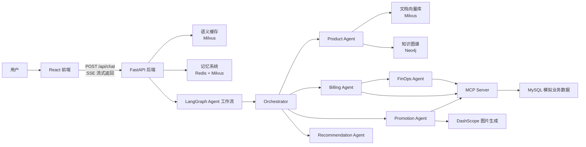

# CloudMind

CloudMind 是一个面向云平台场景的 Multi-Agent 智能客服 Demo。系统通过 FastAPI 提供流式聊天接口，由 LangGraph 编排多个专业 Agent，结合 RAG、知识图谱、MCP 工具、短期/长期记忆和语义缓存，完成云产品咨询、账单查询、实例查询、选型推荐、推广物料生成和 FinOps 成本优化等任务。

## 核心能力

- 多 Agent 路由：Orchestrator 根据用户意图分发到产品、账单、推广、选型或 FinOps Agent。
- 产品咨询：基于 Milvus 文档向量库和 Neo4j 知识图谱回答云产品、规格、地域、规则等问题。
- 账单与实例查询：通过 MCP Server 访问 MySQL 模拟数据，查询用户订单、实例和监控指标。
- FinOps 分析：先查询实例，再读取近 7 天监控数据，给出资源闲置或降配建议。
- 推广营销：查询可推广产品，生成专属推广链接，并可调用 DashScope 生成 AI 海报。
- 记忆与缓存：Redis 保存短期对话，Milvus 保存长期偏好与语义缓存，减少重复请求成本。
- 前端聊天 UI：React + Vite 实现流式对话体验。

## 技术栈

- 前端：React、TypeScript、Vite、Ant Design
- 后端：FastAPI、Server-Sent Events
- Agent：LangChain、LangGraph、OpenAI-compatible LLM API
- 工具协议：MCP / FastMCP
- 数据与检索：Milvus、Neo4j、MySQL、Redis
- 模型服务：SiliconFlow、DashScope

## 架构概览



## 目录结构

```text
.
├── agent/                    # Agent、工作流、记忆、工具和 MCP Server
│   ├── agents/               # 各专业 Agent
│   ├── core/                 # LangGraph 工作流和记忆模块
│   ├── mcp_servers/          # Cloud platform MCP 工具服务
│   ├── tools/                # 向量库和知识图谱构建/查询工具
│   └── config/               # MCP Server 配置
├── backend/                  # FastAPI 服务
│   ├── router/               # API 路由
│   ├── service/              # 聊天服务与 Agent 调用
│   ├── infra/                # 语义缓存等基础设施
│   └── app_config/           # 配置读取
├── frontend/                 # React + Vite 前端
├── mock_data/                # 文档、知识图谱 JSON、MySQL 初始化 SQL
└── docker-compose.yml        # Milvus、etcd、MinIO
```

## 环境准备

建议版本：

- Python 3.11+
- Node.js 20+
- Docker / Docker Compose
- MySQL 8+
- Redis 7+
- Neo4j 5+

`docker-compose.yml` 目前只包含 Milvus 及其依赖的 etcd、MinIO。MySQL、Redis、Neo4j 需要本地单独启动，或按你的部署方式接入。

## 环境变量

后端配置读取 `backend/.env`，Agent 工具和 MCP Server 读取 `agent/.env`。为了避免环境不一致，开发时建议两个文件都放一份相同的核心配置。

`backend/.env` 示例：

```env
SILICONFLOW_API_KEY=your_siliconflow_api_key
SILICONFLOW_BASE_URL=https://api.siliconflow.cn/v1
DASHSCOPE_API_KEY=your_dashscope_api_key
MODEL=deepseek-ai/DeepSeek-V3

REDIS_URL=redis://localhost:6379
REDIS_TTL=1800

MILVUS_HOST=localhost
MILVUS_PORT=19530
MILVUS_API_KEY=

MYSQL_HOST=127.0.0.1
MYSQL_PORT=3306
MYSQL_USER=root
MYSQL_PASSWORD=
MYSQL_DATABASE=cloud_platform

NEO4J_URI=bolt://localhost:7687
NEO4J_USER=neo4j
NEO4J_PASSWORD=cloudmind123
NEO4J_DATABASE=neo4j
```

`agent/.env` 至少需要包含模型、MySQL、Milvus、Neo4j 和 DashScope 相关配置：

```env
SILICONFLOW_API_KEY=your_siliconflow_api_key
SILICONFLOW_BASE_URL=https://api.siliconflow.cn/v1
DASHSCOPE_API_KEY=your_dashscope_api_key
MODEL=deepseek-ai/DeepSeek-V3

MILVUS_HOST=localhost
MILVUS_PORT=19530

MYSQL_HOST=127.0.0.1
MYSQL_PORT=3306
MYSQL_USER=root
MYSQL_PASSWORD=
MYSQL_DATABASE=cloud_platform

NEO4J_URI=bolt://localhost:7687
NEO4J_USER=neo4j
NEO4J_PASSWORD=cloudmind123
NEO4J_DATABASE=neo4j
```

> 注意：`agent/config/mcp_servers.json` 里当前写的是本机虚拟环境 Python 的绝对路径。如果项目目录或虚拟环境位置变化，需要把 `command` 改成你的 Python 解释器路径。

## 快速启动

### 1. 启动 Milvus

```bash
docker compose up -d
```

确认 Milvus 已监听：

```bash
docker compose ps
```

### 2. 启动 MySQL、Redis 和 Neo4j

启动方式不限，只要 `.env` 中的连接信息可用即可。

初始化 MySQL 模拟数据：

```bash
mysql -u root -p < mock_data/init.sql
```

如果 MySQL 没有密码，可去掉 `-p`。

### 3. 安装 Python 依赖

```bash
cd agent
python -m venv .venv
source .venv/bin/activate
pip install -r requirements.txt
```

如运行时提示缺少检索或数据库相关包，可补充安装：

```bash
pip install fastapi langchain-milvus langchain-community langchain-text-splitters langchain-neo4j langchain-mcp-adapters neo4j pymilvus
```

### 4. 构建知识库

导入 `mock_data/*.md` 到 Milvus 文档向量库：

```bash
cd agent
source .venv/bin/activate
python tools/build_vector_db.py
```

导入 `mock_data/ecs_product_info.json` 到 Neo4j 知识图谱：

```bash
cd agent
source .venv/bin/activate
python tools/build_kg.py
```

### 5. 启动后端

```bash
cd backend
../agent/.venv/bin/python main.py
```

服务默认运行在：

```text
http://localhost:8000
```

### 6. 启动前端

```bash
cd frontend
npm install
npm run dev
```

前端默认运行在：

```text
http://localhost:5173
```

## API 示例

聊天接口：

```http
POST /api/chat
Content-Type: application/json
```

请求体：

```json
{
  "query": "帮我查一下最近的订单",
  "user_id": "user_1001",
  "session_id": "session_001"
}
```

接口返回 `text/event-stream`，每个事件形如：

```text
data: {"content":"片段内容"}

data: {"done":true}
```

也可以用 `curl` 测试：

```bash
curl -N http://localhost:8000/api/chat \
  -H "Content-Type: application/json" \
  -d '{"query":"ECS 是什么？","user_id":"user_1001","session_id":"session_001"}'
```

## 示例问题

- `ECS 是什么？`
- `退款规则有哪些限制？`
- `ecs.g8a.xlarge 有多少 vCPU？`
- `帮我查一下最近的订单`
- `帮我看看我的实例是不是太贵了，有没有降本空间`
- `Java + MySQL 的小型业务推荐什么实例？`
- `我想推广 GPU 实例，帮我生成推广链接和海报`

## 开发命令

前端：

```bash
cd frontend
npm run dev
npm run build
npm run lint
```

后端：

```bash
cd backend
../agent/.venv/bin/python main.py
```

Agent 工作流本地测试：

```bash
cd agent
source .venv/bin/activate
python core/workflow/graph_manager.py
```

## 常见问题

### MCP 工具无法启动

检查 `agent/config/mcp_servers.json` 中的 `command` 是否指向真实存在的 Python 解释器。当前配置绑定到了本机路径，换目录或换机器后需要更新。

### 产品咨询查不到文档

确认 Milvus 正常启动，并且已经执行过：

```bash
python agent/tools/build_vector_db.py
```

### 图谱查询失败

确认 Neo4j 已启动，账号密码和 `.env` 一致，并且已经执行过：

```bash
python agent/tools/build_kg.py
```

### 账单或 FinOps 查询没有数据

确认 MySQL 中已经导入 `mock_data/init.sql`，并使用示例用户：

```text
user_1001
user_1002
```

### 语义缓存或短期记忆不可用

语义缓存依赖 Milvus，短期记忆依赖 Redis。两者初始化失败时系统仍可工作，但会失去缓存或记忆能力。

## 说明

这是一个偏 Demo 和原型验证的项目，模拟数据位于 `mock_data/`。生产化前建议补充鉴权、配置隔离、日志监控、错误处理、数据库迁移、测试用例和部署脚本。
