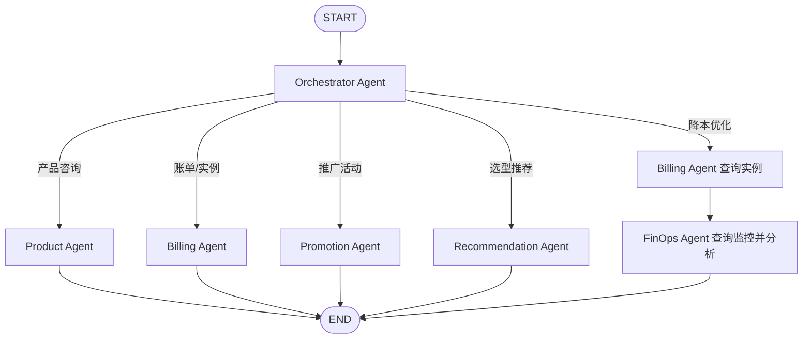

# CloudMind Agent

`agent/` 是 CloudMind 的智能体核心，负责意图路由、多 Agent 编排、知识库检索、MCP 工具调用、记忆管理和数据构建。

## 主要能力

- 使用 LangGraph 编排多 Agent 工作流
- Orchestrator 自动判断用户意图
- Product Agent 查询文档向量库和知识图谱
- Billing Agent 通过 MCP 查询订单和实例
- Promotion Agent 查询推广商品、生成推广链接和 AI 海报
- Recommendation Agent 根据业务场景给出实例选型建议
- FinOps Agent 查询监控数据并给出降本建议
- Redis 保存短期会话记忆
- Milvus 保存长期用户偏好和语义缓存

## 目录结构

```text
agent/
├── agents/
│   ├── orchestrator.py          # 意图路由 Agent
│   ├── product_agent.py         # 产品咨询 Agent
│   ├── billing_agent.py         # 账单/实例查询 Agent
│   ├── promotion_agent.py       # 推广活动 Agent
│   ├── recommendation_agent.py  # 选型推荐 Agent
│   └── finops_agent.py          # 成本优化 Agent
├── config/
│   └── mcp_servers.json         # MCP Server 启动配置
├── core/
│   ├── workflow/                # LangGraph 状态和图管理
│   └── memory/                  # 短期/长期记忆
├── mcp_servers/
│   └── cloud_platform_server.py # Cloud platform MCP 工具服务
├── tools/
│   ├── build_vector_db.py       # 构建 Milvus 文档向量库
│   ├── vector_tool.py           # RAG 查询工具
│   ├── build_kg.py              # 构建 Neo4j 知识图谱
│   └── graph_tool.py            # 知识图谱查询工具
└── requirements.txt
```

## Agent 工作流



## 环境变量

Agent 侧工具和 MCP Server 读取 `agent/.env`。

示例：

```env
SILICONFLOW_API_KEY=your_siliconflow_api_key
SILICONFLOW_BASE_URL=https://api.siliconflow.cn/v1
DASHSCOPE_API_KEY=your_dashscope_api_key
MODEL=deepseek-ai/DeepSeek-V3

MILVUS_HOST=localhost
MILVUS_PORT=19530
MILVUS_API_KEY=

REDIS_URL=redis://localhost:6379
REDIS_TTL=1800

MYSQL_HOST=127.0.0.1
MYSQL_PORT=3306
MYSQL_USER=root
MYSQL_PASSWORD=
MYSQL_DATABASE=cloud_platform

NEO4J_URI=bolt://localhost:7687
NEO4J_USER=neo4j
NEO4J_PASSWORD=cloudmind123
NEO4J_DATABASE=neo4j
```

## 安装依赖

```bash
cd agent
python -m venv .venv
source .venv/bin/activate
pip install -r requirements.txt
```

如果运行知识库工具时提示缺包，可补充：

```bash
pip install langchain-milvus langchain-community langchain-text-splitters langchain-neo4j langchain-mcp-adapters neo4j pymilvus
```

## 外部服务

Agent 依赖以下服务：

- Milvus：文档向量库、长期记忆、语义缓存
- Redis：短期会话记忆
- MySQL：订单、实例、监控指标模拟数据
- Neo4j：云产品知识图谱
- SiliconFlow：LLM 和 embedding
- DashScope：推广海报生成

根目录的 `docker-compose.yml` 只启动 Milvus、etcd 和 MinIO。MySQL、Redis、Neo4j 需要单独启动。

## 初始化数据

### MySQL 模拟数据

在项目根目录执行：

```bash
mysql -u root -p < mock_data/init.sql
```

示例用户：

```text
user_1001
user_1002
```

### Milvus 文档向量库

将 `mock_data/*.md` 导入 `cloud_product_docs` collection：

```bash
cd agent
source .venv/bin/activate
python tools/build_vector_db.py
```

### Neo4j 知识图谱

将 `mock_data/ecs_product_info.json` 导入 Neo4j：

```bash
cd agent
source .venv/bin/activate
python tools/build_kg.py
```

## MCP Server

MCP Server 位于：

```text
agent/mcp_servers/cloud_platform_server.py
```

提供的工具包括：

- `query_user_orders`：查询用户订单
- `query_user_instances`：查询用户实例
- `analyze_instance_usage`：查询近 7 天实例监控并诊断资源状态
- `search_product_catalog`：搜索可推广产品
- `get_promotion_materials`：生成专属推广链接和返佣信息
- `generate_ai_poster`：调用 DashScope 生成推广海报

参考 MCP 配置位于：

```text
agent/config/mcp_servers.json
```

实际运行时，Billing、Promotion 和 FinOps Agent 会通过 `agent/config/mcp_runtime.py` 使用当前 Python 解释器和真实的 `cloud_platform_server.py` 路径动态生成 MCP 连接配置，避免写死本机绝对路径。

`agent/config/mcp_servers.json` 可以作为外部 MCP 客户端接入时的参考：

```json
{
  "mcpServers": {
    "cloud_platform": {
      "command": "python",
      "args": ["mcp_servers/cloud_platform_server.py"],
      "transport": "stdio"
    }
  }
}
```

## 本地测试

测试 Agent 工作流：

```bash
cd agent
source .venv/bin/activate
python core/workflow/graph_manager.py
```

单独启动 MCP Server：

```bash
cd agent
source .venv/bin/activate
python mcp_servers/cloud_platform_server.py
```

通常不需要手动启动 MCP Server，Billing、Promotion 和 FinOps Agent 会通过 `MultiServerMCPClient` 按配置拉起。

## Agent 说明

### Orchestrator Agent

判断用户问题属于哪类业务，并写入 `next_agent`：

- `product_agent`
- `billing_agent`
- `promotion_agent`
- `recommendation_agent`
- `finops_agent`

FinOps 场景会先进入 Billing Agent 查询实例，再交给 FinOps Agent 做分析。

### Product Agent

使用两个工具：

- `query_vector_db`：查文档，适合概念、规则、操作说明
- `query_knowledge_graph`：查图谱，适合规格、地域、关系、参数

### Billing Agent

通过 MCP 查询 MySQL 中的真实模拟数据。工具调用会注入 `user_id`，用于避免越权查询。

### Promotion Agent

通过 MCP 查询推广商品、生成专属链接，并可调用 DashScope 生成推广海报。

### Recommendation Agent

根据业务场景直接使用 LLM 给出入门版和推荐版实例方案。当前未接产品目录工具。

### FinOps Agent

读取 Billing Agent 获取的实例列表，再调用 `analyze_instance_usage` 查询监控数据，输出降本建议。

## 记忆系统

短期记忆：

- 使用 Redis
- 按 `user_id + session_id` 隔离
- 默认 TTL 为 1800 秒
- 消息过多时只保留最近对话

长期记忆：

- 使用 Milvus
- collection：`long_term_memory`
- 存储用户偏好、背景和重要事实
- 每轮对话后后台提取偏好

## 常见问题

### Product Agent 查询不到文档

确认 Milvus 已启动，并且已经执行：

```bash
python tools/build_vector_db.py
```

### 知识图谱查询失败

确认 Neo4j 已启动，账号密码正确，并且已经执行：

```bash
python tools/build_kg.py
```

### Billing 或 FinOps 返回数据库错误

确认 MySQL 已启动、`.env` 连接信息正确，并且 `mock_data/init.sql` 已导入。

### Promotion 不能生成海报

确认 `DASHSCOPE_API_KEY` 已配置。未配置时，推广链接仍可生成，但 AI 海报工具会返回错误。
