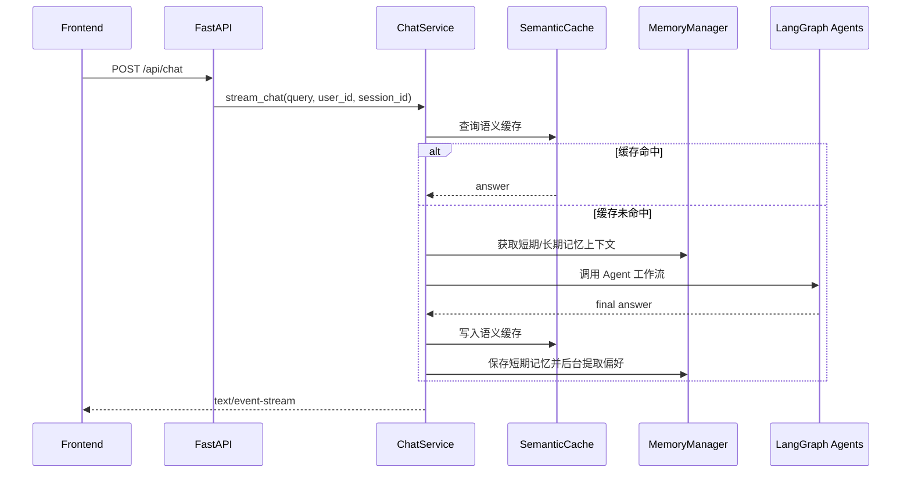

# CloudMind Backend

`backend/` 是 CloudMind 的 FastAPI 服务层，负责接收前端聊天请求、初始化缓存和记忆系统、调用 Agent 工作流，并通过 Server-Sent Events 将回答流式返回给前端。

## 主要职责

- 提供聊天 API：`POST /api/chat`
- 使用 SSE 流式返回 Agent 回复
- 初始化 `ChatService`
- 初始化语义缓存、短期记忆和长期记忆
- 调用 `agent/` 里的 LangGraph 多 Agent 工作流
- 统一读取后端运行配置

## 目录结构

```text
backend/
├── app_config/
│   └── settings.py          # pydantic-settings 配置入口
├── infra/
│   └── cache.py             # Milvus 语义缓存
├── router/
│   └── chat_router.py       # /api/chat 路由
├── schemas/
│   └── chat.py              # 请求体 schema
├── service/
│   └── chat_service.py      # 聊天主服务，调用 Agent 图
└── main.py                  # FastAPI 应用入口
```

## 请求链路



## 环境变量

后端通过 `backend/app_config/settings.py` 读取 `backend/.env`。

示例：

```env
SILICONFLOW_API_KEY=your_siliconflow_api_key
SILICONFLOW_BASE_URL=https://api.siliconflow.cn/v1
DASHSCOPE_API_KEY=your_dashscope_api_key
MODEL=deepseek-ai/DeepSeek-V3

REDIS_URL=redis://localhost:6379
REDIS_TTL=1800

MILVUS_HOST=localhost
MILVUS_PORT=19530
MILVUS_API_KEY=

MYSQL_HOST=127.0.0.1
MYSQL_PORT=3306
MYSQL_USER=root
MYSQL_PASSWORD=
MYSQL_DATABASE=cloud_platform

NEO4J_URI=bolt://localhost:7687
NEO4J_USER=neo4j
NEO4J_PASSWORD=cloudmind123
NEO4J_DATABASE=neo4j
```

## 启动方式

后端依赖 `agent/requirements.txt` 中的 Python 包，建议直接使用 `agent/.venv`。

```bash
cd ../agent
python -m venv .venv
source .venv/bin/activate
pip install -r requirements.txt
```

启动后端：

```bash
cd ../backend
../agent/.venv/bin/python main.py
```

默认地址：

```text
http://localhost:8000
```

## API

### POST `/api/chat`

请求体：

```json
{
  "query": "帮我查一下最近的订单",
  "user_id": "user_1001",
  "session_id": "session_001"
}
```

响应类型：

```text
text/event-stream
```

响应片段：

```text
data: {"content":"您好"}

data: {"done":true}
```

`curl` 示例：

```bash
curl -N http://localhost:8000/api/chat \
  -H "Content-Type: application/json" \
  -d '{"query":"ECS 是什么？","user_id":"user_1001","session_id":"session_001"}'
```

## 关键模块说明

### `main.py`

创建 FastAPI 应用，配置 CORS，注册 `/api` 路由，并在 lifespan 中调用 `chat_service.initialize()`。

### `service/chat_service.py`

聊天核心流程：

1. 查询语义缓存
2. 获取短期和长期记忆上下文
3. 调用 LangGraph Agent 工作流
4. 写入语义缓存
5. 保存对话历史
6. 后台提取长期偏好
7. 分块输出 SSE

### `infra/cache.py`

使用 Milvus 保存问答语义缓存，支持：

- `public` 公共缓存
- `user` 用户专属缓存
- 精确匹配
- 向量相似匹配

如果 Milvus 不可用，语义缓存会自动禁用，不阻断主聊天流程。

## 联调注意事项

- 前端默认请求 `http://localhost:8000/api/chat`。
- 后端启动时会导入 `../agent` 到 Python path，因此需要保持当前目录结构。
- Agent 侧还会读取 `agent/.env`，不要只配置 `backend/.env`。
- Redis 或 Milvus 不可用时，记忆/缓存能力会降级，但主流程仍可继续。
- 账单、推广和 FinOps 能力依赖 MCP Server，MCP 配置位于 `agent/config/mcp_servers.json`。

## 常见问题

### 后端启动时报模型或 API key 错误

检查 `backend/.env` 和 `agent/.env` 是否都配置了 `SILICONFLOW_API_KEY`、`SILICONFLOW_BASE_URL` 和 `MODEL`。

### `/api/chat` 没有持续输出

确认前端或客户端按 SSE 方式读取响应，并使用 `curl -N` 测试。

### 账单查询失败

检查 MySQL 是否启动、`mock_data/init.sql` 是否已导入，以及 MCP Server 的 Python 路径是否正确。

